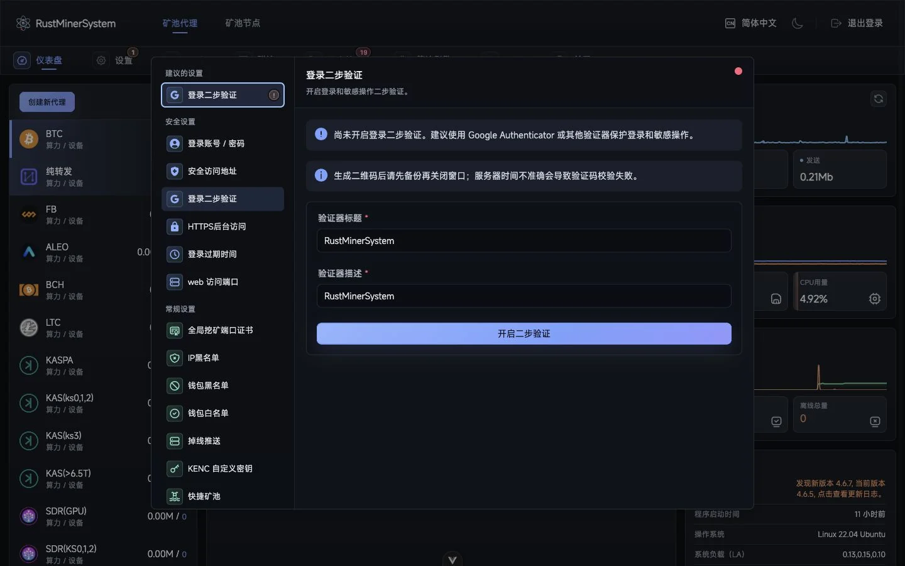

<div align="center">
  

  <h1>TCMinerProxy – Mining Pool Relay Proxy</h1>

  <p>
    <strong>Rust-based mining pool relay forwarding software with a brand-new architecture, representing the next-generation top-tier pool relay solution.</strong>
  </p>

  <p>
    Built for mining farms, pool operators, and infrastructure teams that need controlled hashrate allocation, reliable miner access, and clear operations tooling.
  </p>

  <p>
    <a href="https://tcminerproxy.com/">
      
    </a>
    <a href="https://github.com/MinerProxyPro/TCMinerProxy">
      
    </a>
    <a href="https://github.com/MinerProxyPro/TMS">
      
    </a>
  </p>

  <p>
    <a href="https://t.me/tcminerproxy">
      
    </a>
    <a href="https://discord.gg/PCKrcNArBE">
      
    </a>
    <a href="https://x.com/tcminerproxy">
      
    </a>
    <a href="https://github.com/MinerProxyPro/TCMinerProxy/releases/latest">
      
    </a>
  </p>
</div>

<p align="center">
  
</p>

## Product Map

<table>
  <tr>
    <td width="33%" valign="top">
      
      <h3>TCMinerProxy</h3>
      <p>
        The core proxy and operations console for miner access, third-party pool
        forwarding, port management, device statistics, logs, and allocation rules.
      </p>
      <p><a href="https://github.com/MinerProxyPro/TCMinerProxy">Open repository</a></p>
    </td>
    <td width="33%" valign="top">
      
      <h3>TMS Secure Client</h3>
      <p>
        Optional local encrypted compression client for sites that want lower
        bandwidth usage and fewer public connections while keeping miners nearby.
      </p>
      <p>
        <a href="https://github.com/MinerProxyPro/TMS">TMS3</a>
        |
        <a href="https://github.com/MinerProxyPro/TMS/tree/main/OLD_2">TMS2</a>
      </p>
    </td>
    <td width="33%" valign="top">
      
      <h3>PoolNode</h3>
      <p>
        Build a self-owned real mining pool node and distribute configured fees
        at the coin settlement layer instead of only at the forwarding layer.
      </p>
      <p>
        <a href="https://tcminerproxy.com/document/poolnode">Read PoolNode docs</a>
      </p>
    </td>
  </tr>
</table>

## What It Solves

| Area                  | Capability                                                                            |
| --------------------- | ------------------------------------------------------------------------------------- |
| Miner access          | Direct TCP/SSL access, or optional TMS encrypted compression for local sites          |
| Pool relay            | Forward connected miners to third-party pools with centralized port and route control |
| Hashrate allocation   | Route configured shares to specified pool wallets or worker names                     |
| PoolNode mode         | Run a real pool node and apply fees at settlement level                               |
| Operations            | Monitor hashrate, online/offline devices, latency, logs, versions, and system load    |
| Multi-site management | Manage local facilities, cloud nodes, clients, and regional access from one console   |

```text
Miner devices
    |
    | TCP / SSL or optional TMS encrypted compression
    v
TCMinerProxy
    |-- third-party pool relay and wallet allocation
    |-- PoolNode real-pool settlement workflow
    |-- dashboard, logs, device stats, and remote operations
```

## Featured Links

| Resource                                                                   | Description                                                        |
| -------------------------------------------------------------------------- | ------------------------------------------------------------------ |
| [Official Website](https://tcminerproxy.com/)                              | Product overview, downloads, documentation, and multilingual pages |
| [TCMinerProxy](https://github.com/MinerProxyPro/TCMinerProxy)              | Core server, proxy engine, dashboard, and PoolNode system          |
| [TMS3](https://github.com/MinerProxyPro/TMS)                               | Current secure local client                                        |
| [RMS2](https://github.com/MinerProxyPro/TMS/tree/main/OLD_2)               | Legacy secure local client                                         |
| [TCMinerProxy Docs](https://tcminerproxy.com/document/tcminerproxy)        | Deployment, configuration, and operations guide                    |
| [TMS Docs](https://tcminerproxy.com/document/tms)                          | Secure client setup and network optimization workflow              |
| [TCMinerProxy CLI](https://tcminerproxy.com/document/tcminerproxy-cli)     | Command-line management documentation                              |
| [Downloads](https://tcminerproxy.com/download/tcminerproxy-core-server)    | Core server, secure client, and mobile app downloads               |

## Tech Stack

<p>
  
  
  
  
  
  
</p>

## Supported Workflows

| Workflow               | TCMinerProxy support                                                                      |
| ---------------------- | -------------------------------------------------------------------------------------------- |
| Third-party pool proxy | Route miners through a controlled forwarding layer                                           |
| Site-side optimization | Use TMS when bandwidth, public connections, or encrypted local access matter                 |
| Self-owned pool        | Use PoolNode to operate a real pool and settle configured fees at coin level                 |
| Custom management      | Extend operations with local APIs, remote clients, and tailored deployments                  |
| Community support      | Follow releases, deployment notes, and troubleshooting through GitHub, Telegram, Discord, X, and Reddit |

## Community

<p>
  <a href="https://github.com/MinerProxyPro">
    
  </a>
  <a href="https://t.me/tcminerproxy">
    
  </a>
  <a href="https://discord.gg/PCKrcNArBE">
    
  </a>
  <a href="https://x.com/tcminerproxy">
    
  </a>
</p>

> TCMinerProxy is infrastructure software for legitimate mining-farm and
> pool-operations scenarios. Users are responsible for following local laws,
> platform rules, and the requirements of the pools or services they connect to.
